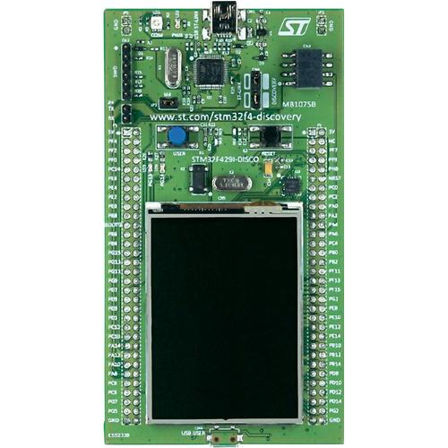
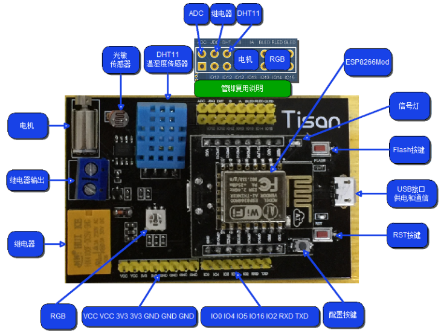
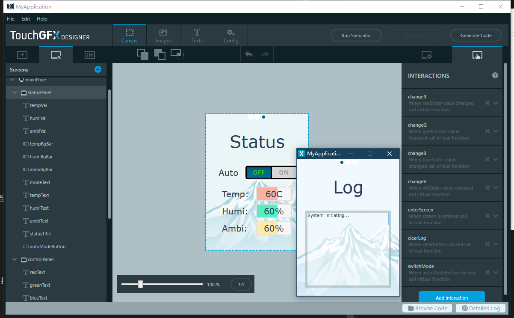
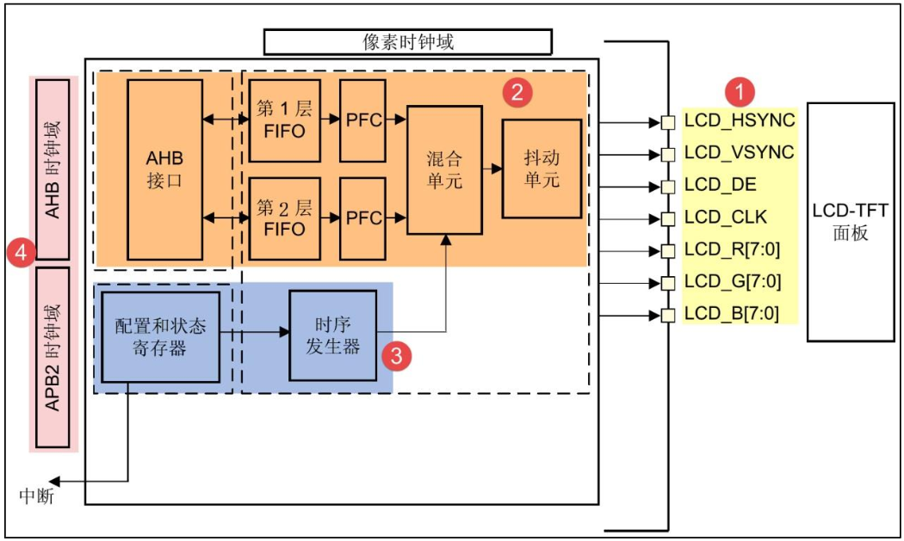
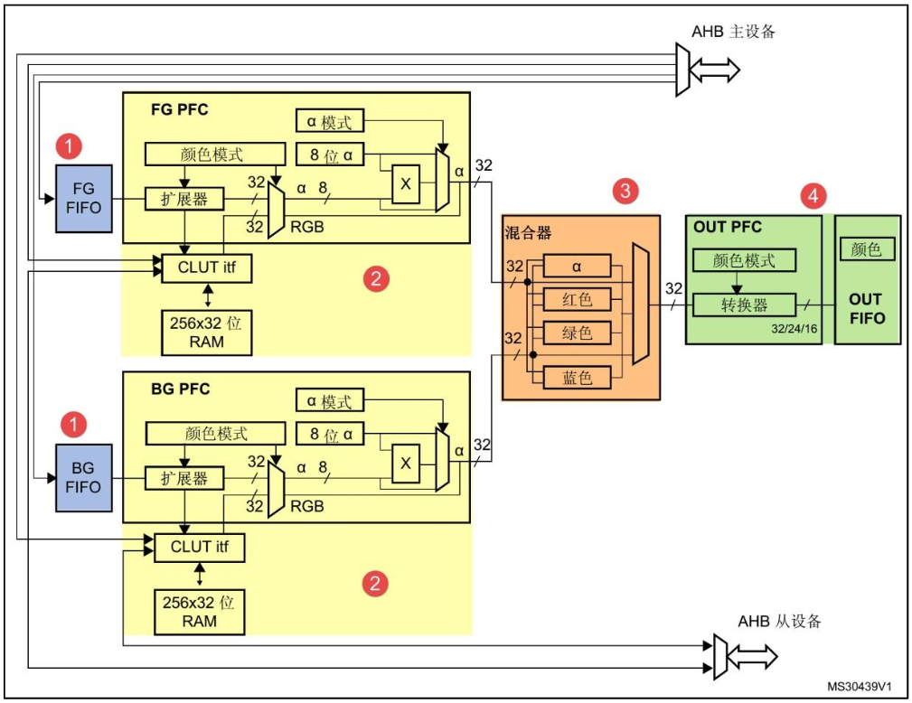
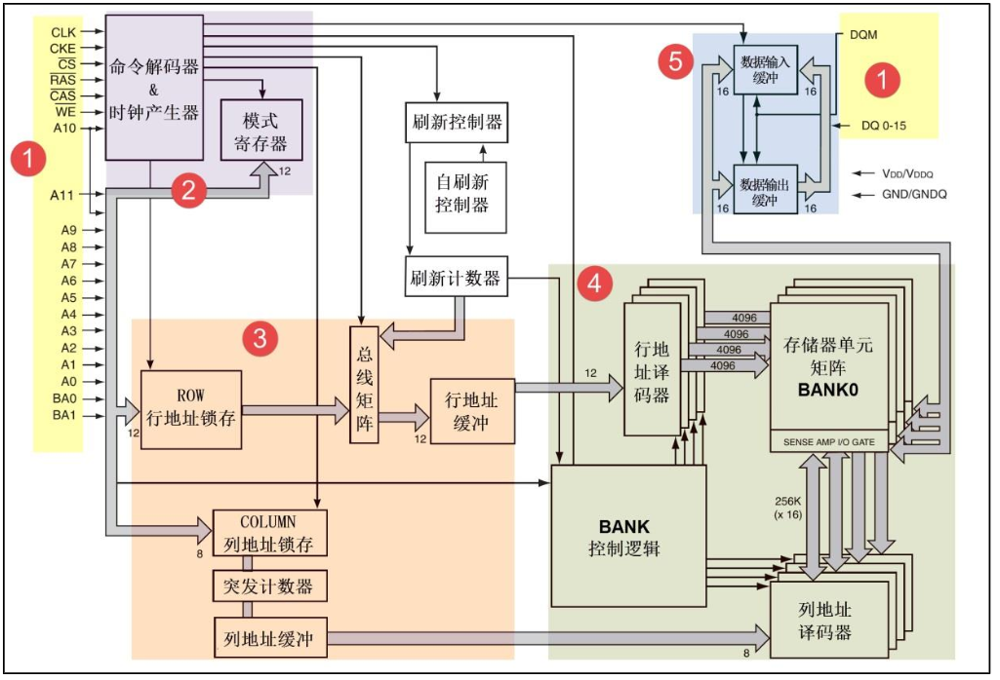
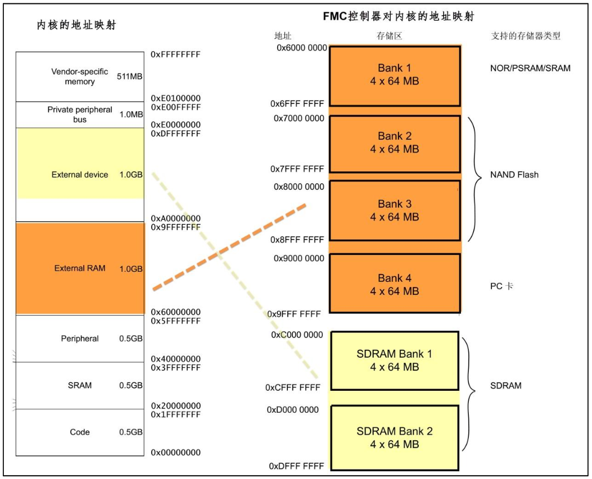

# Inefficient outdated Things
#### SUSTech CS301 - Embedded - Final Project

## Introduction

本项目使用STM32F429和ESP8266制作简易智能家居系统。

### Hardware

本项目选用STM32F429I Discovery官方开发板，其硬件特性有

- MCU: STM32F429ZIT6
  - 片内2MB Flash & 256KB SRAM
  - 支持LTDC，DMA2D (aka Chrom-Art Accelerator )，FMC
- 板载8MB SDRAM
- 2.4寸TFT LCD，电阻屏
- 板载STLink/V2



另外也选用了基于ESP8266的Tisan开发板（已停产）



- MCU: ESP-12F
  - 4MB SPI Flash & 50KB SRAM
- 板载DHT11温湿度传感器
- 板载光敏电阻
- 板载震动马达

### Software

- STM32
  - IDE: STM32CubeIDE
  - OS: FreeRTOS
  - GUI: TouchGFX
  - GUI Design Tool: TouchGFXDesigner
- ESP8266
  - Firmware: NodeMCU （自带RTOS，和lua解释器）
  - 编译环境: NodeMCU Cloud Build Service
  - 烧录工具: NodeMCU PyFlasher
  - Lua IDE: ESPlorer

## Implement

### GUI

GUI使用了TouchGFX

TouchGFXDesigner可用于绘制GUI，编译生成Simulator以及生成CubeIDE可用的代码



先添加控件，修改属性

然后添加Interaction，使其生成虚函数的回调函数

在Text选项卡中修改字符集

即可生成代码

生成的代码使用了MVP设计模式

RTOS的一个线程会定时激活TouchGFX的线程，在这个过程中，Model里的代码会被调用

### GUI 2D加速

实现GUI的硬件加速借助了STM32F4特有的三个外设: LTDC, DMA2D, FMC

这三个外设对应的功能是：驱动LCD屏幕，渲染并传输帧缓存，驱动显存（片外SDRAM）

TouchGFX原生支持这三个外设

#### LTDC



- 驱动屏幕，传输数据至屏幕
- 支持多种颜色格式
- 支持两个图层

#### DMA2D aka Chrom-Art Accelerator



- 可将显存内容传输至LTDC
- 支持多种颜色格式
- 支持两个图层

#### FMC





- 将存储芯片空间映射到内存上
- 可以控制外部SRAM，SDRAM或NAND

### 内部通讯

主从机通信采用SPI全双工通信，其中STM32为从机，ESP8266为主机

注：NodeMCU固件目前只支持SPI主机模式

#### 引脚连接

| 源引脚 | 源引脚说明        | 目标引脚 | 目标引脚说明    |
| ------ | ----------------- | ----- | --------------- |
| GPIO12 | Tisan HSPI MISO   | PE5   | STM32 SPI4 MISO |
| GPIO13 | Tisan HSPI MOSI   | PE6   | STM32 SPI4 MOSI |
| GPIO14 | Tisan HSPI CLK    | PE2   | STM32 SPI4 CLK  |
| GPIO15 | Tisan HSPI CS     | GND   |                 |
| GPIO16 | Tisan IO Index: 4 | DHT   | Tisan板载DHT11  |
| GLED   | Tisan板载七色灯   | PB7   | STM32 TIM4 CH2  |
| RLED   | Tisan板载七色灯   | PB4   | STM32 TIM3 CH1  |
| BLED   | Tisan板载七色灯   | PB3   | STM32 TIM2 CH2  |
| IA     | Tisan板载震动马达 | PC8   | STM32 TIM3 CH3  |
| ADC    | Tisan板载光敏电阻 | ADC0  | Tisan ADC       |

#### 主从机通信指令

主机发送40位指令，从机发送8位返回值

| 指令          | byte0 | byte1        | byte2       | byte3       | byte4    | return  val |
| ------------- | ----- | ------------ | ----------- | ----------- | -------- | ----------- |
| 寄存器写8位   | 0x11  | 写寄存器编号 |             | 写数据低8位 | checksum | checksum    |
| 寄存器写16位  | 0x12  | 写寄存器编号 | 写数据高8位 | 写数据低8位 | checksum | checksum    |
| 寄存器读低8位 | 0x21  | 读寄存器编号 |             |             | checksum | 读数据低8位 |
| 寄存器读高8位 | 0x22  | 读寄存器编号 |             |             | checksum | 读数据高8位 |

注：checksum = byte0 xor byte1 xor byte2 xor byte3

寄存器定义:

| 寄存器内容       | 编号 | 类型     | 有效值 |
| ---------------- | ---- | -------- | ------ |
| LED灯R           | 0x01 | uint16_t | 0-1024 |
| LED灯G           | 0x02 | uint16_t | 0-1024 |
| LED灯B           | 0x03 | uint16_t | 0-1024 |
| 马达转速         | 0x04 | uint16_t | 0-1024 |
| 温度             | 0x05 | uint8_t  | 0-100  |
| 湿度             | 0x06 | uint8_t  | 0-100  |
| 环境光强         | 0x07 | uint16_t | 0-1024 |
| 自动模式状态     | 0x0B | uint8_t  | 0, 1   |
| 自动模式光照阈值 | 0x0C | uint16_t | 0-1024 |

### 外部通信

NodeMCU和服务器间的通信采用MQTT协议，报文采用JSON格式

#### MQTT 消息队列遥测传输

- 使用发布/订阅消息模式
- 小型传输，开销很小（固定长度的头部是 2 字节）
- 多种消息发布服务质量
    - QoS=0: 至多一次
    - QoS=1: 至少一次
    - QoS=2: 只有一次

#### 发送报文

发送报文的内容有
- Unix时间戳
- 传感器数据
- 状态（如LED状态）

NodeMCU每10秒发送一次报文，QoS=1，Topic为`/node0/pub`

Example:
```json
{
    "timestamp": 1577107816,
    "sensor": {
        "humi": 21,
        "temp": 24,
        "ambi": 1008
    },
    "status": {
        "led": {
            "r": 512,
            "g": 127,
            "b": 0
        },
        "motor": {
            "speed": 1020
        },
        "node": {
            "auto_mode": 0,
            "ambi_throttle": 800
        }
    }
}
```

#### 接收报文

接收报文的内容有
- 指令（如LED亮度）

约定，当值为-1时，忽略该值

NodeMCU订阅Topic:`/node0/sub`

Example:
```json
{
    "cmd": {
        "led": {
            "r": 512,
            "g": 127,
            "b": 0
        },
        "motor": {
            "speed": 1020
        },
        "node": {
            "auto_mode": 0,
            "ambi_throttle": 800
        }
    }
}
```

### 时间同步

NodeMCU会通过SNTP简单网络时间协议获得当前时间并产生准确的时间戳

SNTP的服务器地址：`203.107.6.88`

注：STM32的RTC外设并没有启用

## Known issues

- NodeMCU的SPI在全双工模式下并不能同时接收数据
- SPI容易出现时序不同步，造成数据出错